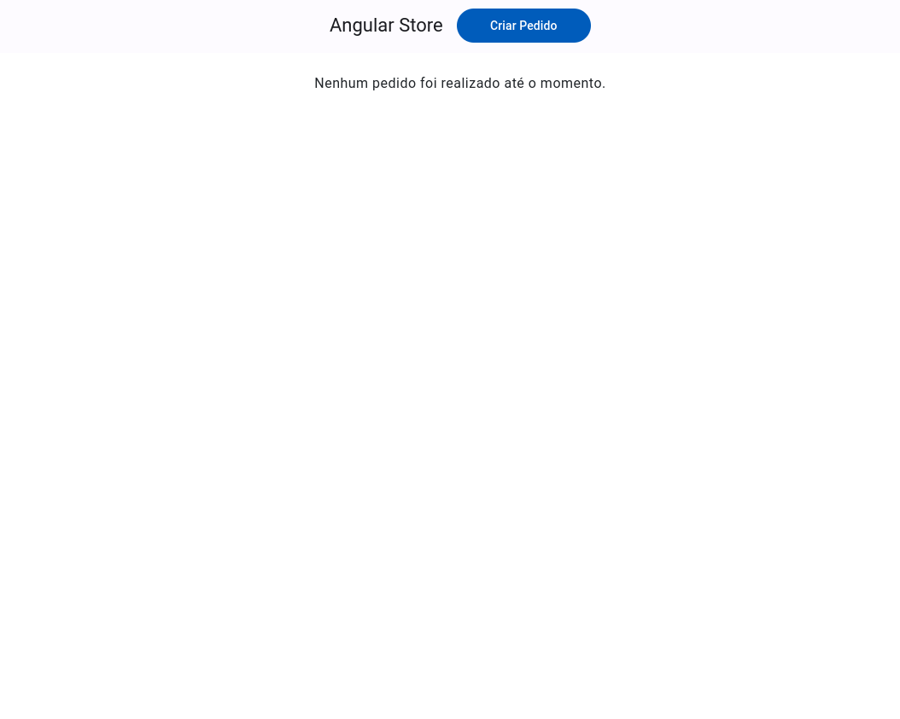
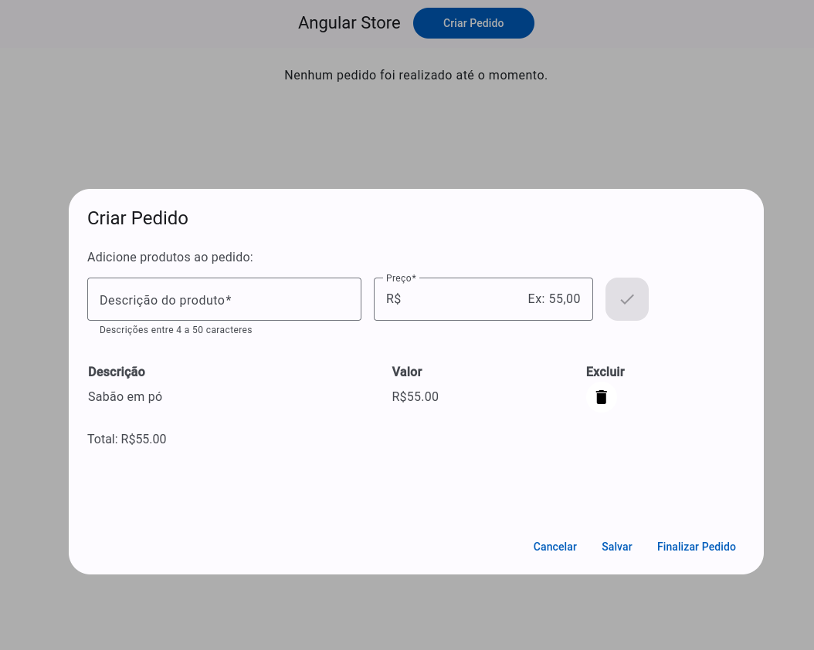
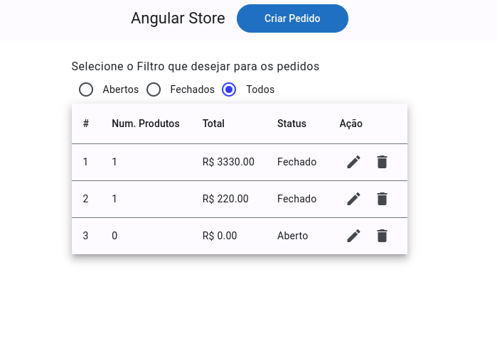
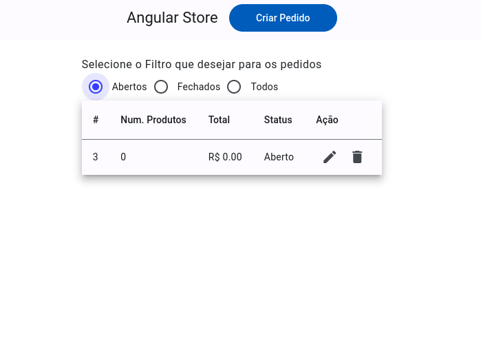

# Angular Store

## Descrição

Este é um sistema de gerenciamento de pedidos criado com Angular 18. A aplicação permite criar, editar e gerenciar pedidos e produtos. Os pedidos podem ser classificados como abertos ou fechados e devem atender a certos critérios antes de serem finalizados.

Para simular a persistência de dados foi utilizado o localStorage do navegador com [RxJs](https://rxjs.dev/guide/overview).

A aplicação pode ser acessada também aqui [Angular Store](https://angular-store-guilhermeag.vercel.app/).

## Estrutura do Projeto

### Entidades

#### Order (Representa um Pedido)

- **Code Number**: Único e controlado pelo Local Storage.
- **Products**: Array de `Product[]` (0 ou N produtos).
- **Status**: Booleano (`true` para aberto, `false` para fechado).
- **Total**: Número positivo.
- **Regras**:
  - Um pedido só pode ser fechado se tiver pelo menos um produto.

#### Product (Representa um Produto)

- **Description**: String, com 4 a 50 caracteres.
- **Price**: Número positivo.

### Capturas de tela






### Services

#### OrdersService.ts

- **`getOrders()`**: Retorna todos os pedidos (`Order[]`).
- **`getOrder(code: number)`**: Retorna um pedido específico. Verifica se o pedido existe.
- **`createOrder(order: Order)`**: Cria um novo pedido.
- **`updateOrder(order: Order)`**: Atualiza um pedido existente. Verifica se o pedido está aberto e se existe.
- **`closeOrder(code: number)`**: Finaliza um pedido. Verifica se o pedido está aberto e se existe.
- **`clearOrdersData()`**: Limpa a lista de pedidos.

## Tecnologias Utilizadas

- **Angular 18**: Framework para construção de aplicações web.
- **TypeScript**: Linguagem de programação para desenvolvimento Angular.
- **RxJS**: Biblioteca para programação reativa.
- **Bootstrap e Angular Material**: Framework CSS para estilização e layout.

## Instalação

1. **Clone o Repositório**:

```bash
   git clone https://github.com/guilhermag/angular-store.git
```

2. **Navegue para o Diretório do Projeto**:

```bash
   cd angular-store
```

3. **Instale as Dependências**:

```bash
   npm install
```

4. **Inicie o Servidor de Desenvolvimento**:

```bash
   ng serve
```

5. **Abra no Navegador**:

Acesse http://localhost:4200 para visualizar a aplicação.

## Créditos

Desenvolvido por Guilherme de Araujo Gabriel.
